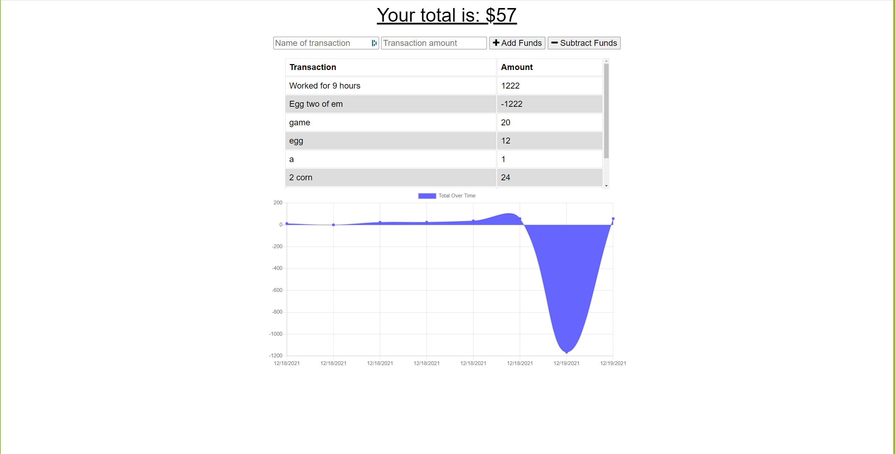

# Budget Tracker

## Table of Contents

- [Description](#description)
- [Installation](#installation)
- [Usage](#usage)
- [Screenshot](#screenshot)

## Description

This is an application that allows the user to keep track of what they've spent over a period of time. If the user does not have spent over a period of time. If the user does not have an internet connection, the user's data will be stored and submitted

## Installation

Run "npm i" to install the needed dependancies.

## Usage

Input how much money you have saved or spent by inputting the amount and what it is you did/bought into the proper boxes and then press the corresponding button to confirm.

## Screenshot

